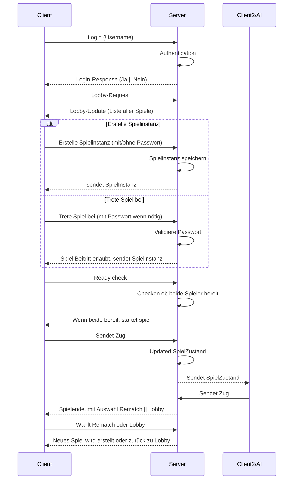

```mermaid
sequenceDiagram
    Client->>Server: Login (Username)
    Server->>Server: Authentication
    Server -->>Client: Login-Response (Ja || Nein)

    Client->>Server: Lobby-Request
    Server-->>Client: Lobby-Update (Liste aller Spiele)

    alt Erstelle Spielinstanz
        Client->>Server: Erstelle Spielinstanz (mit/ohne Passwort)
        Server->>Server: Spielinstanz speichern
        Server-->>Client: sendet SpielInstanz
    else Trete Spiel bei
        Client->>Server: Trete Spiel bei (mit Passwort wenn nötig)
        Server->>Server: Validiere Passwort
        Server-->>Client: Spiel Beitritt erlaubt, sendet Spielinstanz
    end

    Client->>Server: Ready check
    Server->>Server: Checken ob beide Spieler bereit
    Server-->>Client: Wenn beide bereit, startet spiel

    Client->>Server: Sendet Zug
    Server->>Server: Updated SpielZustand
    Server-->>Client2/AI: Sendet SpielZustand
    Client2/AI->>Server: Sendet Zug

    Server-->>Client: Spielende, mit Auswahl Rematch || Lobby
    Client->>Server: Wählt Rematch oder Lobby
    Server-->>Client: Neues Spiel wird erstellt oder zurück zu Lobby

```
