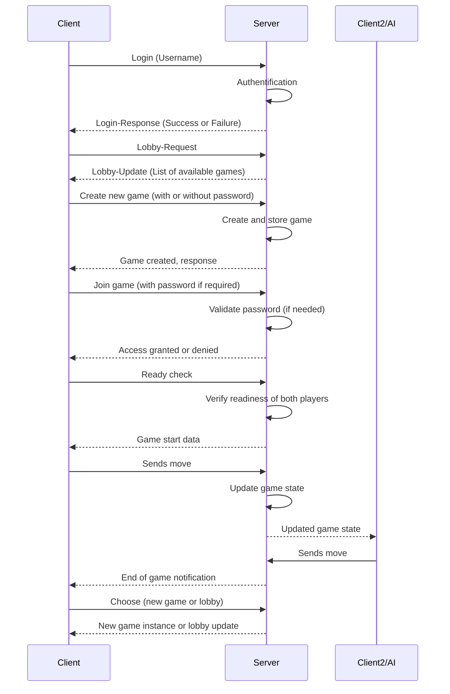

```mermaid
sequenceDiagram


Client->>Server: Login (Username)
Server->>Server: Authentification
Server -->>Client: Login-Response (Success or Failure)

Client->>Server: Lobby-Request
Server-->>Client: Lobby-Update (List of available games)

Client->>Server: Create new game (with or without password)
Server->>Server: Create and store game
Server-->>Client: Game created, response

Client->>Server: Join game (with password if required)
Server->>Server: Validate password (if needed)
Server-->>Client: Access granted or denied

Client->>Server: Ready check
Server->>Server: Verify readiness of both players
Server-->>Client: Game start data

Client->> Server: Sends move
Server->>Server: Update game state
Server-->>Client2/AI: Updated game state
Client2/AI->> Server: Sends move

Server-->>Client: End of game notification
Client->>Server: Choose (new game or lobby)
Server-->>Client: New game instance or lobby update
```
